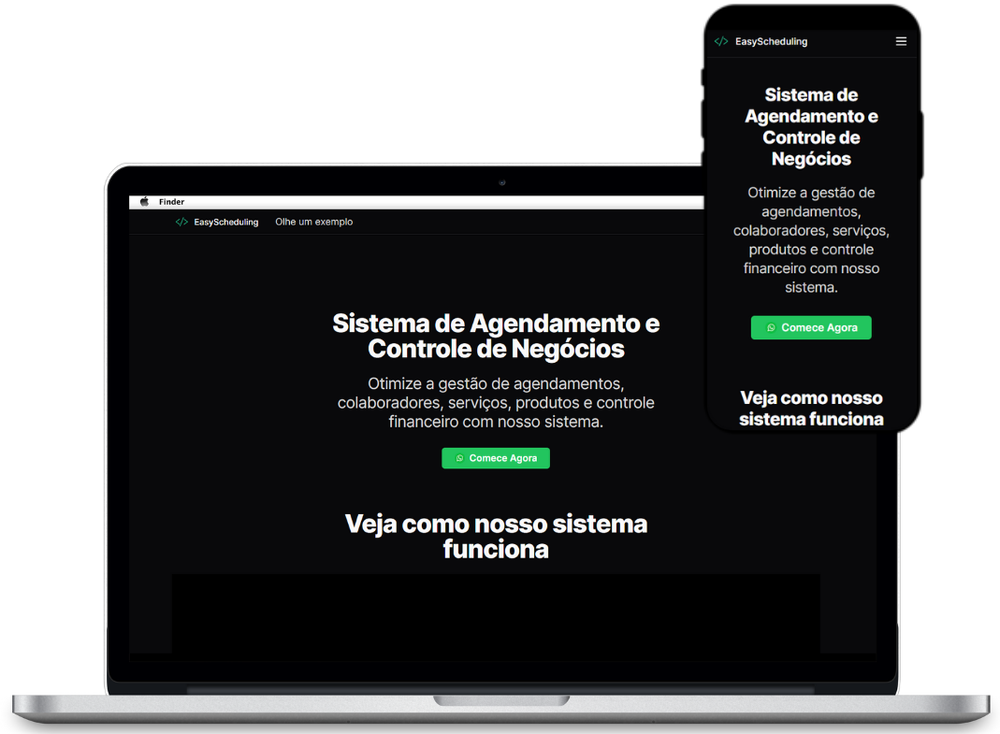

# EasyScheduling Landing Page

Bem-vindo à landing page do EasyScheduling. Este repositório contém o código-fonte da nossa página inicial, que foi adaptada de um projeto open source para atender às nossas necessidades específicas.

## Introdução

A landing page foi criada para demonstrar o sistema web EasyScheduling e captar novos clientes.



## Executar o Projeto

Você pode rodar o projeto localmente ou usando Docker.

Para rodar o projeto localmente, siga os passos abaixo:

```bash
npm install
npm run dev
```

Abra http://localhost:3000 no seu navegador para ver o resultado.

Para rodar o projeto via docker, siga os passos abaixo:

```bash
docker-compose up
```

O projeto ficará disponível na porta 3001. Abra http://localhost:3001 no seu navegador para ver o resultado.

## Stack Tecnológica

- **Next.js 14**: Framework de React para a construção de aplicações web.
- **shadcn**: Biblioteca de componentes UI que utiliza TailwindCSS.
- **Docker**: Utilizado para containerização da aplicação.
- **Docker Compose**: Para orquestração de containers Docker.

## Créditos

- Este projeto foi baseado no [saas-landingpage](https://github.com/AtotheY/saas-landingpage) criado por [Anthony Sistilli](https://github.com/AtotheY).
